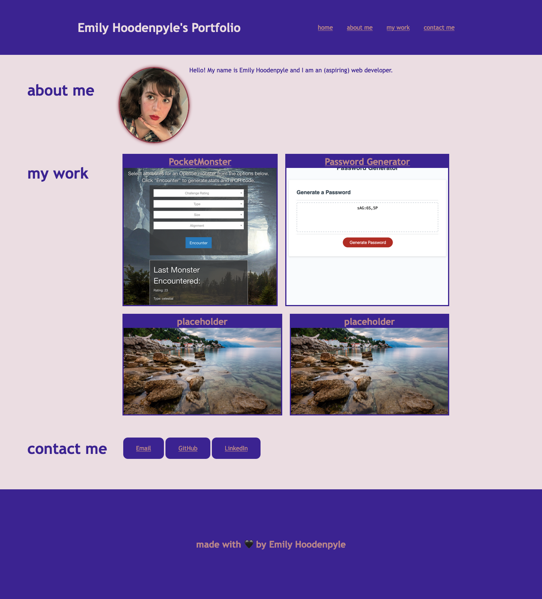

<Portfolio>

## Description

This is my portfolio! It is a work in progress, as I will be adding to it as my skills grow over the course of this class. Within the portfolio, you will find a short About Me section, samples of my previous work, and links to the best modes to contact me.

## Table of Contents
- [Installation](#installation)
- [Credits](#credits)
- [License](#license)

## Installation

In order to install this project, you will need to havev already installed Visual Studio Code (or some other code editing software with HTML and CSS capabilities). From there it is just a matter of cloning the SSH key to your desktop and openning the files in your editing software.

## Credits

This code was made from scratch by me, with references to inclass assignment material provided by the University of Washington continuing education program's full stack part-time course, instructor John Young.

## License

Copyright (c) 2022 Emily Hoodenpyle

Permission is hereby granted, free of charge, to any person obtaining a copy
of this software and associated documentation files (the "Software"), to deal
in the Software without restriction, including without limitation the rights
to use, copy, modify, merge, publish, distribute, sublicense, and/or sell
copies of the Software, and to permit persons to whom the Software is
furnished to do so, subject to the following conditions:

The above copyright notice and this permission notice shall be included in all
copies or substantial portions of the Software.

THE SOFTWARE IS PROVIDED "AS IS", WITHOUT WARRANTY OF ANY KIND, EXPRESS OR
IMPLIED, INCLUDING BUT NOT LIMITED TO THE WARRANTIES OF MERCHANTABILITY,
FITNESS FOR A PARTICULAR PURPOSE AND NONINFRINGEMENT. IN NO EVENT SHALL THE
AUTHORS OR COPYRIGHT HOLDERS BE LIABLE FOR ANY CLAIM, DAMAGES OR OTHER
LIABILITY, WHETHER IN AN ACTION OF CONTRACT, TORT OR OTHERWISE, ARISING FROM,
OUT OF OR IN CONNECTION WITH THE SOFTWARE OR THE USE OR OTHER DEALINGS IN THE
SOFTWARE.

## Link to deployed project

(https://emilyhoodenpyle.github.io/portfolio/)

## Image of finished webpage
